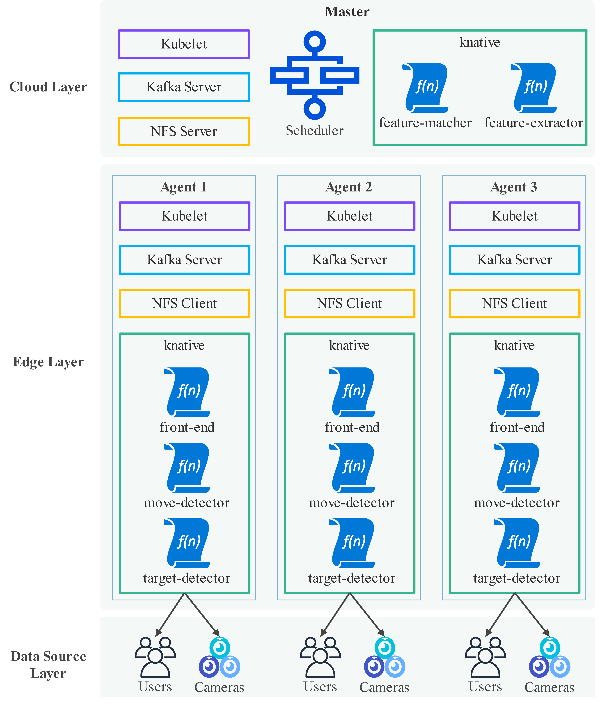
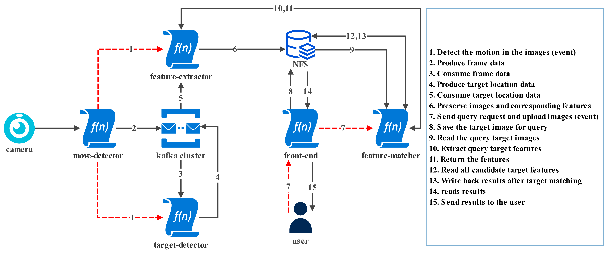
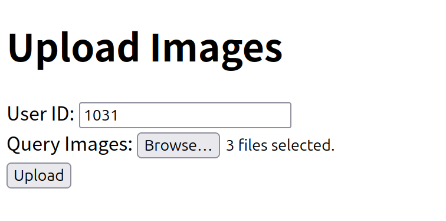
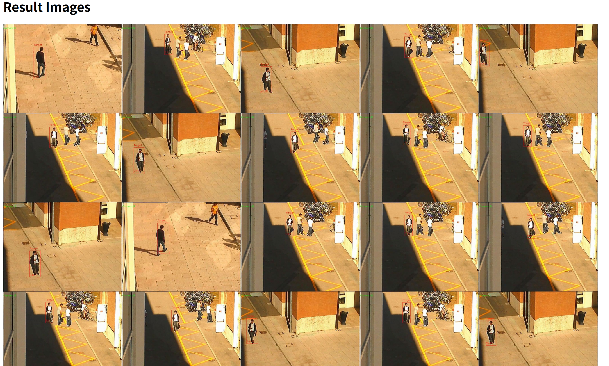
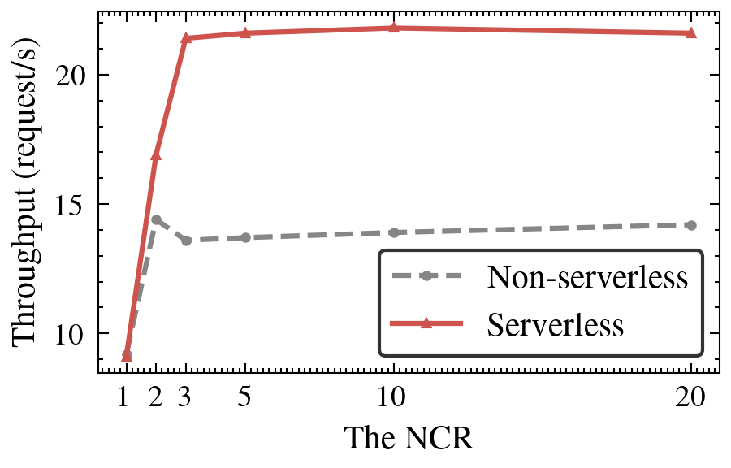
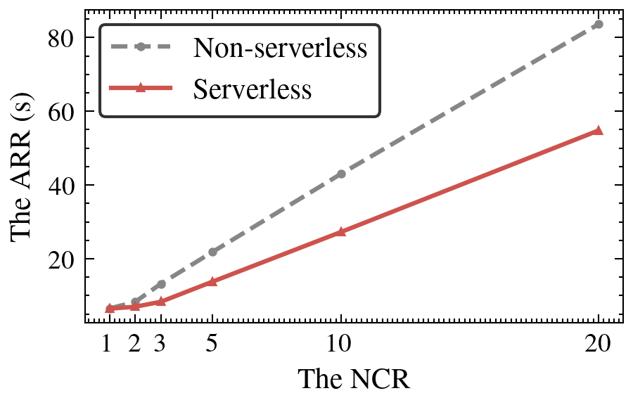
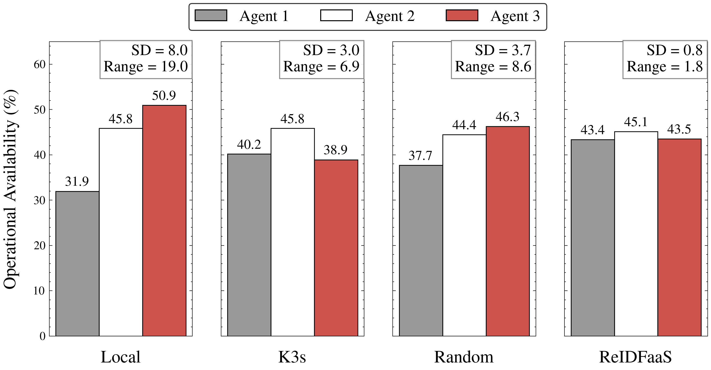
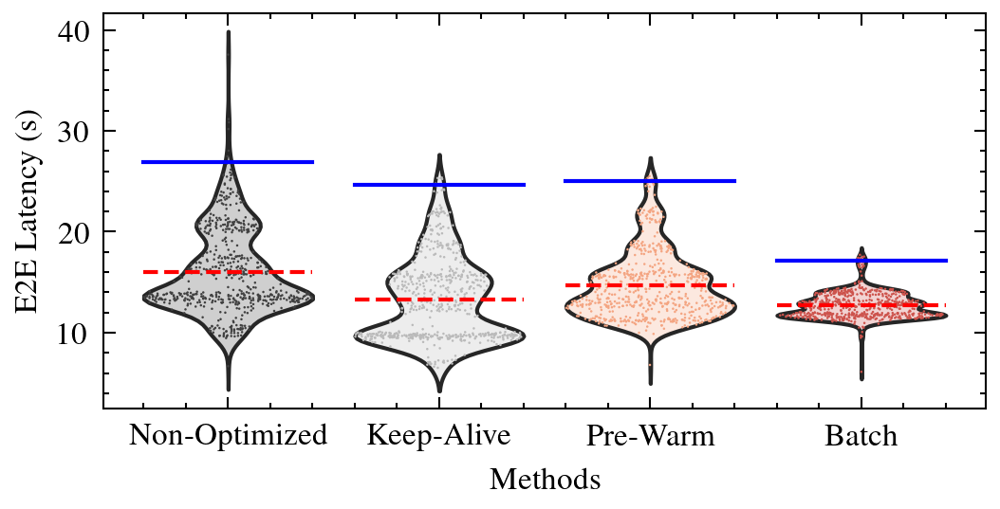
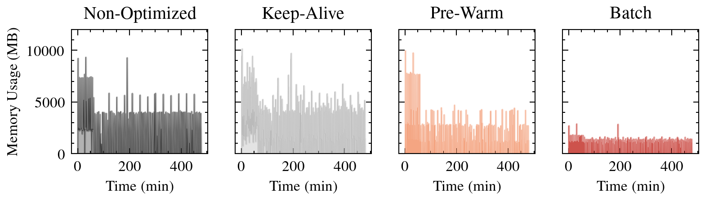

<div align="center">

# ReIDFaaS

### An Energy-Efficient Serverless Person Re-Identification System Across the Edge-Cloud Continuum

### 面向边缘-云连续体的节能无服务器行人重识别系统

[](https://ieeexplore.ieee.org/document/11169601/)
[](https://www.python.org/)
[](https://pytorch.org/)
[](https://knative.dev/)
[](https://k3s.io/)
[](LICENSE)

[Paper](https://ieeexplore.ieee.org/document/11169601/) |
[Project Page](https://jianpingpei.github.io/Energy-Efficient-ReIDFaaS/) |
[Code](https://github.com/jianpingpei/Energy-Efficient-ReIDFaaS)

</div>

---

## Overview / 概述

**ReIDFaaS** is a serverless person re-identification (Re-ID) system designed for energy-efficient, low-latency operation across the edge-cloud continuum. It replaces traditional always-on surveillance pipelines with an event-driven architecture triggered by pedestrian movement, significantly reducing resource consumption on energy-constrained edge devices.

**ReIDFaaS** 是一个面向边缘-云连续体的无服务器行人重识别 (Re-ID) 系统，旨在实现节能和低延迟的运行。它用基于行人运动触发的事件驱动架构取代了传统的常驻监控流水线，显著降低了资源受限边缘设备上的资源消耗。

Published at **IEEE International Conference on Web Services (ICWS) 2025**.

发表于 **IEEE 国际 Web 服务会议 (ICWS) 2025**。

---

## Highlights / 亮点

<table>
<tr>
<td align="center"><b>23.3%</b><br/>Edge Node Availability<br/>边缘节点可用性提升</td>
<td align="center"><b>55%</b><br/>Memory Reduction<br/>内存占用降低</td>
<td align="center"><b>53%</b><br/>Throughput Improvement<br/>吞吐量提升</td>
<td align="center"><b>30%</b><br/>P99 Latency Reduction<br/>P99 延迟降低</td>
</tr>
</table>

---

## Key Contributions / 核心贡献

1. **Event-Driven Re-ID Workflow / 事件驱动重识别工作流**
   An event-driven Re-ID system replacing continuous computation with pedestrian movement-triggered execution, significantly reducing resource usage while maintaining real-time performance.
   基于行人运动触发的事件驱动系统，用运动检测替代持续计算，显著减少资源使用的同时保持实时性能。

2. **Energy-Efficient Scheduling / 节能调度**
   A hardware-aware dynamic scheduler that allocates tasks based on real-time energy states, hot container availability, and load constraints, improving edge node availability by 23.3%.
   感知硬件状态的动态调度器，基于实时能量状态、热容器可用性和负载约束分配任务，将边缘节点可用性提升 23.3%。

3. **Adaptive Batching for Cold-Start Mitigation / 自适应批处理冷启动缓解**
   An adaptive batching mechanism that reduces cold-start frequency through latency-constrained request grouping, reducing 99th percentile latency by 30% and average memory usage by 55%.
   基于延迟约束的自适应批处理机制，通过智能请求分组减少冷启动频率，将 P99 延迟降低 30%，平均内存使用降低 55%。

---

## System Architecture / 系统架构

ReIDFaaS employs a three-tier edge-cloud architecture (Data Source, Edge, Cloud) with Kafka for data streaming and NFS for persistent storage. Knative on K3s enables serverless auto-scaling and event-driven execution.

ReIDFaaS 采用三层边缘-云架构（数据源层、边缘层、云层），使用 Kafka 进行数据流传输，NFS 提供持久化存储。基于 K3s 的 Knative 实现无服务器自动扩缩容和事件驱动执行。

<p align="center">
  
</p>

The system consists of five core serverless functions:

系统由五个核心无服务器函数组成：

| Function | Layer | Description |
|----------|-------|-------------|
| **move-detector** | Edge | Captures camera streams and detects pedestrian movement via Lucas-Kanade optical flow / 捕获摄像头流并通过光流法检测行人运动 |
| **target-detector** | Edge | Pedestrian detection and tracking using YOLOX + ByteTrack / 使用 YOLOX + ByteTrack 进行行人检测和跟踪 |
| **feature-extractor** | Cloud | Extracts ReID appearance features using M3L model / 使用 M3L 模型提取重识别外观特征 |
| **feature-matcher** | Cloud | Matches query features against candidates via cosine similarity / 通过余弦相似度匹配查询特征 |
| **front-end** | Edge | Web interface for uploading query images and viewing results / 用于上传查询图片和查看结果的 Web 界面 |

---

## Workflow / 工作流程

<p align="center">
  
</p>

The 15-step workflow operates as follows / 15 步工作流程如下：

1. **Movement Detection (Steps 1-2)**: `move-detector` processes video streams, detects pedestrian movement, activates downstream functions, and sends relevant frames to Kafka.
2. **Target Detection (Steps 3-4)**: `target-detector` uses YOLOX + ByteTrack for pedestrian detection and tracking, outputs bounding boxes to Kafka.
3. **Feature Extraction (Steps 5-6)**: `feature-extractor` uses M3L to extract appearance features, stores results to NFS.
4. **Query Initialization (Steps 7-8)**: User uploads query images via `front-end`, triggering `feature-matcher`.
5. **Feature Matching (Steps 9-13)**: `feature-matcher` obtains query features, matches against historical features on NFS, writes results.
6. **Result Visualization (Steps 14-15)**: `front-end` reads results from NFS and displays them to the user.

---

## Project Structure / 项目结构

```
Energy-Efficient-ReIDFaaS/
├── common/                         # Shared utilities / 公共工具库
│   ├── BaseService.py              # Abstract base service (Kafka + queue)
│   ├── DetTrackResult.py           # Data objects for detection/tracking results
│   ├── Get_Param.py                # Environment variable parameter fetcher
│   ├── Logger.py                   # Colored logging utility
│   └── kafka/                      # Kafka consumer/producer wrappers
├── move-detector/                  # Motion detection function / 运动检测函数
│   ├── move-detector.py            # Flask app (port 3001)
│   └── optical_flow.py             # Lucas-Kanade optical flow (CPU + CUDA)
├── target-detector/                # Object detection + tracking / 目标检测+跟踪
│   ├── target-detector.py          # Flask app (port 4001)
│   ├── model/bytetracker.py        # ByteTracker with YOLOX
│   └── yolox/                      # YOLOX framework
├── feature-extractor/              # Feature extraction function / 特征提取函数
│   ├── feature-extractor.py        # Flask app (port 6001)
│   └── M3L/                        # M3L ReID model architecture
├── feature-matcher/                # Single-request feature matching / 单请求特征匹配
│   ├── feature-matcher.py          # Flask app (port 5001)
│   ├── multi_img_matching.py       # Cosine similarity matching
│   └── store_result.py             # Save annotated result images
├── feature-matcher-batch/          # Batch feature matching / 批量特征匹配
│   ├── feature-matcher-batch.py    # Flask app (port 5001) with adaptive batching
│   ├── multi_img_matching.py       # Batch matching logic
│   └── store_result.py             # Save annotated result images
├── front-end/                      # Web UI function / Web 界面函数
│   ├── front-end.py                # Flask app (port 8080)
│   └── templates/result.html       # Result display template
├── scheduler/                      # Energy-aware task scheduler / 节能任务调度器
│   └── scheduler.py                # Priority-based node selection (port 2001)
├── models/                         # Pre-trained model weights / 预训练模型权重
│   ├── m3l.pth                     # M3L ReID model
│   └── yolox.pth                   # YOLOX pedestrian detection
├── yaml/                           # Kubernetes/Knative manifests / K8s 部署清单
│   ├── functions/                  # Knative service definitions
│   ├── pv/                         # PersistentVolume (NFS)
│   └── pvc/                        # PersistentVolumeClaim
├── *.Dockerfile                    # Container images / 容器镜像定义
├── assets/                         # Figures from the paper / 论文图片
└── docs/                           # Project homepage / 项目主页
```

---

## Prerequisites / 环境依赖

Before deploying ReIDFaaS, ensure the following infrastructure is ready:

部署 ReIDFaaS 前，请确保以下基础设施已就绪：

| Component | Description |
|-----------|-------------|
| **K3s** | Lightweight Kubernetes cluster with 1 master + N agent nodes / 轻量级 K8s 集群 |
| **Knative** | Serverless framework installed on K3s for auto-scaling / 安装在 K3s 上的无服务器框架 |
| **Apache Kafka** | Distributed message queue cluster / 分布式消息队列集群 |
| **NFS** | Network File System for shared persistent storage / 网络文件系统用于共享持久存储 |
| **Docker** | Container runtime for building images / 容器运行时 |
| **NVIDIA GPU** (optional) | For GPU-accelerated inference on edge/cloud nodes / 用于 GPU 加速推理 |

### Hardware Requirements (Reference Testbed) / 硬件需求（参考测试平台）

| Node | CPU | GPU | Memory | Role |
|------|-----|-----|--------|------|
| Master | 32 cores | NVIDIA RTX 3080Ti | 256GB | Control plane + feature-matcher + feature-extractor |
| Agent 1 | 8 cores | NVIDIA RTX 1080Ti | 32GB | Edge node (5 cameras) |
| Agent 2 | 4 cores | None | 16GB | Edge node (1 camera) |
| Agent 3 | 8 cores | 32 Tensor cores (Jetson Orin NX) | 16GB | Edge node (2 cameras) |

---

## Deployment / 部署指南

### Step 1: Build Docker Images / 构建 Docker 镜像

Build container images for each function using the provided Dockerfiles:

使用提供的 Dockerfile 为每个函数构建容器镜像：

```bash
# GPU functions (require CUDA runtime)
docker build -f target-detector-gpu.Dockerfile -t <registry>/target-detector:latest .
docker build -f feature-extractor-gpu.Dockerfile -t <registry>/feature-extractor:latest .
docker build -f feature-matcher-gpu.Dockerfile -t <registry>/feature-matcher:latest .
# or batch version / 或批量版本
docker build -f feature-matcher-batch-gpu.Dockerfile -t <registry>/feature-matcher-batch:latest .

# CPU functions
docker build -f move-detector.Dockerfile -t <registry>/move-detector:latest .
docker build -f front-end.Dockerfile -t <registry>/front-end:latest .
docker build -f scheduler.Dockerfile -t <registry>/scheduler:latest .

# Push to your registry / 推送到镜像仓库
docker push <registry>/target-detector:latest
# ... push all images
```

### Step 2: Configure Environment Variables / 配置环境变量

Identify the API addresses for the key functions and configure them in the YAML files:

确认关键函数的 API 地址并在 YAML 文件中配置：

| Variable | Description | Example |
|----------|-------------|---------|
| `KAFKA_BIND_ENDPOINTS` | Kafka cluster nodes (pipe-separated) | `192.168.10.2:9092\|192.168.10.3:9092` |
| `url_va` | target-detector API address | `http://target-detector.default.svc.cluster.local` |
| `url_fe` | feature-extractor API address | `http://feature-extractor.default.svc.cluster.local` |
| `url_reid` | feature-matcher API address | `http://feature-matcher.default.svc.cluster.local` |

- Add `url_va` and `url_fe` to **move-detector**'s environment configuration.
- Add `url_reid` to **front-end**'s environment configuration.

### Step 3: Configure Storage / 配置存储

Deploy PersistentVolume and PersistentVolumeClaim, binding PV to your NFS server:

部署 PersistentVolume 和 PersistentVolumeClaim，将 PV 绑定到 NFS 服务器：

```bash
# Edit yaml/pv/reid-pv.yaml to set your NFS server address and path
# 编辑 yaml/pv/reid-pv.yaml 设置 NFS 服务器地址和路径
kubectl apply -f yaml/pv/reid-pv.yaml
kubectl apply -f yaml/pvc/reid-pvc.yaml
```

### Step 4: Update YAML Manifests / 更新 YAML 清单

Modify the Knative service definitions in `yaml/functions/` to update:

修改 `yaml/functions/` 中的 Knative 服务定义：

- Container image addresses / 容器镜像地址
- Kafka endpoint environment variables / Kafka 端点环境变量
- Function API addresses / 函数 API 地址

### Step 5: Deploy Functions / 部署函数

```bash
# Deploy all Knative services / 部署所有 Knative 服务
kubectl apply -f yaml/functions/sheduler.yaml
kubectl apply -f yaml/functions/move-detector-1.yaml
kubectl apply -f yaml/functions/target-detector-1.yaml
kubectl apply -f yaml/functions/feature-extractor.yaml
kubectl apply -f yaml/functions/feature-matcher.yaml      # or feature-matcher-batch.yaml
kubectl apply -f yaml/functions/front-end.yaml
```

### Step 6: Start Surveillance / 启动监控

Bind a camera to `move-detector` by sending:

向 `move-detector` 发送以下请求绑定摄像头：

```bash
curl -X POST http://<move-detector-endpoint>/ \
  -H "Content-Type: application/json" \
  -d '{
    "fps": "15",
    "video_id": "cam_01",
    "video_address": "rtsp://your-camera-address"
  }'
```

### Step 7: Query Targets / 查询目标

Access the `front-end` service in your browser to upload query images and view Re-ID results:

在浏览器中访问 `front-end` 服务，上传查询图片并查看重识别结果：

| Upload Interface / 上传界面 | Query Results / 查询结果 |
|:--:|:--:|
|  |  |

---

## Experimental Results / 实验结果

### Serverless vs. Non-Serverless / 无服务器 vs. 非无服务器

ReIDFaaS achieves **identical Re-ID accuracy** (mAP 54.5%, Rank-1 76.0% on Market-1501 + MSMT17) while significantly improving resource efficiency:

ReIDFaaS 在保持**相同的重识别精度**（Market-1501 + MSMT17 上 mAP 54.5%，Rank-1 76.0%）的同时显著提升了资源效率：

| Dataset | mAP | Rank-1 |
|---------|-----|--------|
| Market-1501 | 68.4 | 87.2 |
| MSMT17 | 40.5 | 64.9 |
| 3DPeS (real video) | 88.5 | 100.0 |

<p align="center">
  
  
</p>
<p align="center"><i>Serverless achieves 53% higher throughput and 35% lower response latency.</i></p>
<p align="center"><i>无服务器架构实现了 53% 的吞吐量提升和 35% 的响应延迟降低。</i></p>

### Energy-Efficient Scheduling / 节能调度

<p align="center">
  
</p>

| Scheduler | Agent 1 | Agent 2 | Agent 3 | **Total Remaining** |
|-----------|---------|---------|---------|---------------------|
| Local | 1196Wh | 264Wh | 220Wh | 1680Wh |
| K3s | 1504Wh | 264Wh | 168Wh | 1936Wh |
| Random | 1412Wh | 256Wh | 200Wh | 1868Wh |
| **ReIDFaaS** | **1624Wh** | **260Wh** | **188Wh** | **2072Wh** |

ReIDFaaS scheduler achieves the **lowest SD (0.8%) and range (1.8%)** in operational availability, ensuring balanced energy consumption across heterogeneous nodes.

ReIDFaaS 调度器实现了**最低的标准差 (0.8%) 和极差 (1.8%)**，确保异构节点间均衡的能量消耗。

### Cold-Start Mitigation / 冷启动缓解

<p align="center">
  
  
</p>

| Method | P99 Latency | Avg Memory Reduction |
|--------|-------------|---------------------|
| Non-Optimized | 27.0s | baseline |
| Keep-Alive | 24.5s | +76% overhead |
| Pre-Warm | 25.0s | baseline |
| **Batch (Ours)** | **17.2s** | **-55%** |

---

## Tech Stack / 技术栈

| Category | Technologies |
|----------|-------------|
| **Language** | Python 3.8 / 3.11 |
| **Deep Learning** | PyTorch 2.2, TorchVision 0.17 |
| **Detection** | YOLOX-S (pedestrian detection) |
| **Tracking** | ByteTrack (multi-object tracking) |
| **ReID** | M3L (Memory-based Multi-source Meta-Learning) |
| **Motion Detection** | Lucas-Kanade Optical Flow (CPU + CUDA) |
| **Web Framework** | Flask 2.2 |
| **Message Queue** | Apache Kafka |
| **Container Orchestration** | K3s (lightweight Kubernetes) |
| **Serverless** | Knative Serving |
| **GPU Runtime** | CUDA 12.1, cuDNN 9 |
| **Storage** | NFS (Network File System) |

---

## Citation / 引用

If you find this work useful, please cite our paper:

如果您觉得这项工作有帮助，请引用我们的论文：

```bibtex
@INPROCEEDINGS{11169601,
  author    = {Pei, Jianping and Shu, Yanjun and Ma, Zhuangyu and Zuo, Decheng and Zhang, Zhan},
  booktitle = {2025 IEEE International Conference on Web Services (ICWS)},
  title     = {ReIDFaaS: An Energy-Efficient Serverless Person Re-Identification System Across the Edge-Cloud Continuum},
  year      = {2025},
  pages     = {365-371},
  doi       = {10.1109/ICWS67624.2025.00052}
}
```

---

## Acknowledgments / 致谢

This research is supported by / 本研究受以下项目资助：
- National Key Research and Development Program of China (Grant No. 2024YFB4506003) / 国家重点研发计划
- National Natural Science Foundation of China (Grant Nos. 61202091, 62171155) / 国家自然科学基金

---

## License

This project is licensed under the [MIT License](LICENSE).
